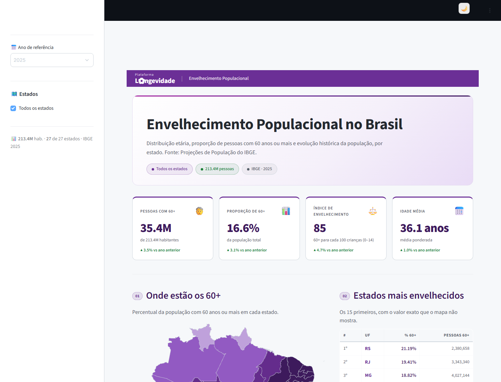

# Envelhecimento Populacional no Brasil

Visualização da distribuição etária da população brasileira por estado, com foco no envelhecimento populacional (2010–2025), a partir das Projeções de População do IBGE.



Acesso: https://painel.cenarios.unb.br/cenarios/demografico-longevidade

## Relação com o `dashboard-demografico`

Este painel nasceu como cópia do
[dashboard-demografico](https://github.com/Mcardosor/dashboard-demografico) —
o histórico é o mesmo até o commit `1d89ac2`, que trouxe o mapa em pydeck.
Os dois convivem no ar, em rotas e portas diferentes, e daqui pra frente
divergem: este recebe identidade visual própria.

O que já é diferente: rota `/cenarios/demografico-longevidade`, porta 8508 no
host, container `dashboard-demografico-longevidade`, o nome exibido e **a
identidade visual** — marca, paleta roxa e a rampa do mapa vêm do
[longevidade.unb.br](https://longevidade.unb.br). Ver
[Identidade visual](docs/identidade.md).

## Conteúdo

- **Mapa coroplético em quartis**, com cortes fixos do período — sem basemap,
  sem fornecedor de ladrilho
- **Tabela dos estados mais envelhecidos**, com o valor exato que o mapa não dá
- **Pirâmide etária** em faixas de 5 anos, por sexo
- **Distribuição por sexo**, geral ou restrita a quem tem 60 anos ou mais
- **Evolução da população**, 2010–2025
- **Quatro KPIs** com comparativo ao ano anterior: pessoas com 60+, proporção
  de 60+, índice de envelhecimento e idade média

O painel fala **"60+"**, não "idosos", em tudo que o leitor vê — ver
[Documentação dos Gráficos](docs/DOCUMENTACAO_GRAFICOS.md).

## Documentação

| Documento | Descrição |
|---|---|
| [Arquitetura](docs/ARQUITETURA.md) | Fluxo de dados ponta a ponta, módulos, deploy e limitações — comece por aqui |
| [Documentação dos Gráficos](docs/DOCUMENTACAO_GRAFICOS.md) | Por que cada gráfico existe, como é calculado e o código |
| [Identidade visual](docs/identidade.md) | A paleta roxa do Observatório, de onde veio cada cor e o que reprovou na validação |
| [Deploy na VM](docs/deploy-vm.md) | Bootstrap na `cenarios-vm`: portas, rota do nginx e a pegadinha do prefixo |
| [Performance](docs/performance.md) | Linha de base medida, o que foi otimizado e os alvos presos em teste |

## Filtros

- Ano de referência — atualiza KPIs e gráficos, com comparativo automático ao ano anterior
- Seleção de estados — individual ou por região (Norte, Nordeste, Centro-Oeste, Sudeste, Sul)
- Toggle "apenas ≥ 60 anos" no gráfico de distribuição por sexo

## Stack

| Camada | Tecnologia |
|---|---|
| Interface | Streamlit |
| Visualizações | Plotly (`bar`, `pie`, `line`) |
| Mapa | pydeck / deck.gl (`GeoJsonLayer`), **sem basemap** — malha pré-processada em `data/ufs.geojson` |
| Dados | Parquet (IBGE), pandas, cache via `@st.cache_data` |

## Como rodar

```bash
git clone https://github.com/Mcardosor/dashboard-demografico-longevidade
cd dashboard-demografico-longevidade
pip install -r requirements.lock.txt
streamlit run app.py
```

Acesse em `http://localhost:8508/cenarios/demografico-longevidade` — o caminho
tem prefixo porque o `.streamlit/config.toml` mantém o mesmo `baseUrlPath` de
produção, então o que se vê local é o que está no ar.

Roda em **Python 3.13** desde que o `pandas` subiu para 2.2.3, que foi a versão
a publicar wheels `cp313`. Antes disso o lock só instalava em 3.11 e o Docker
era obrigatório para desenvolver. A imagem de produção segue em
`python:3.11-slim`.

No Windows, `rodar_dashboard.bat` cria o ambiente na primeira execução e sobe
o painel.

## Testes e scripts

```bash
pip install -r requirements-dev.txt
pytest                            # 46 testes: malha, mapa e orçamento de tempo
pytest -m "not tempo"             # o subconjunto que o CI roda (sem tetos de relógio)
python -m scripts.medir_performance   # linha de base, sem o cache do Streamlit
python -m scripts.preparar_geometria  # regera data/ufs.geojson a partir da malha crua
```

`preparar_geometria` só precisa rodar quando a malha de origem mudar — a saída
é versionada. É o único script que usa geopandas e topojson, que por isso ficam
em `requirements-dev.txt` e fora da imagem de produção.

Os testes com a marca `tempo` cronometram relógio de parede contra um teto
absoluto e ficam de fora do CI: num runner compartilhado a medida diz mais
sobre a carga da máquina alheia do que sobre o código. O porquê está em
`pytest.ini`.

## Dependências

| Arquivo | Papel |
|---|---|
| `requirements.txt` | **Intenção** — as 4 dependências diretas |
| `requirements.lock.txt` | **Realidade** — as 38 versões exatas; é daqui que o Dockerfile instala |

As quatro diretas já estavam pinadas e conferem com a VM. O que faltava eram
as 34 transitivas (altair, numpy, protobuf, pillow…), livres para mudar entre
dois builds do mesmo commit. O lock foi capturado do container em execução, e
não resolvido do zero, para que travar as versões não mudasse nada em produção.

Para regenerar, depois de mexer no `requirements.txt`:

```bash
docker run --rm -v "$PWD:/w" -w /w python:3.11-slim \
  sh -c "pip install -q -r requirements.txt && pip freeze" > requirements.lock.txt
```

Resolva **dentro do `python:3.11-slim`**, não no Python da sua máquina: a
resolução muda conforme a versão do interpretador, e o que vale é a da imagem.

## O que o CI cobre

[`.github/workflows/ci.yml`](.github/workflows/ci.yml) roda a cada push e PR:
`ruff check .`, o build da imagem, e um diff entre o `pip freeze` da imagem e o
lock.

**Este painel não tem testes.** O CI pega import quebrado, erro de sintaxe e
lock que parou de instalar — não pega número errado. Conferir se o painel está
mostrando o dado certo continua sendo trabalho de olhar o painel.

## Dados

Projeções de População do IBGE (2010–2025), por município, faixa etária e sexo. O pipeline de tratamento não está neste repositório — os `.parquet` em `/data` já vêm prontos para uso.

## Estrutura

```
dashboard-demografico/
├── app.py                  # entrada principal — sidebar, filtros, layout
├── src/
│   ├── charts.py           # figuras Plotly
│   ├── data.py              # carregamento e cache
│   ├── themes.py            # tokens de cor dark/light
│   └── utils.py             # formatação e componentes HTML
├── data/
│   ├── pop_ibge.parquet
│   ├── ibge_municipios.parquet
│   ├── ibge_ufs.parquet
│   └── brazil-states.geojson
└── requirements.txt
```
